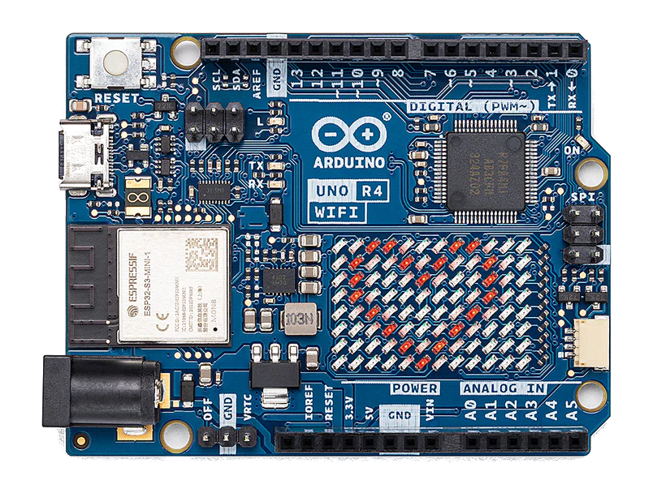
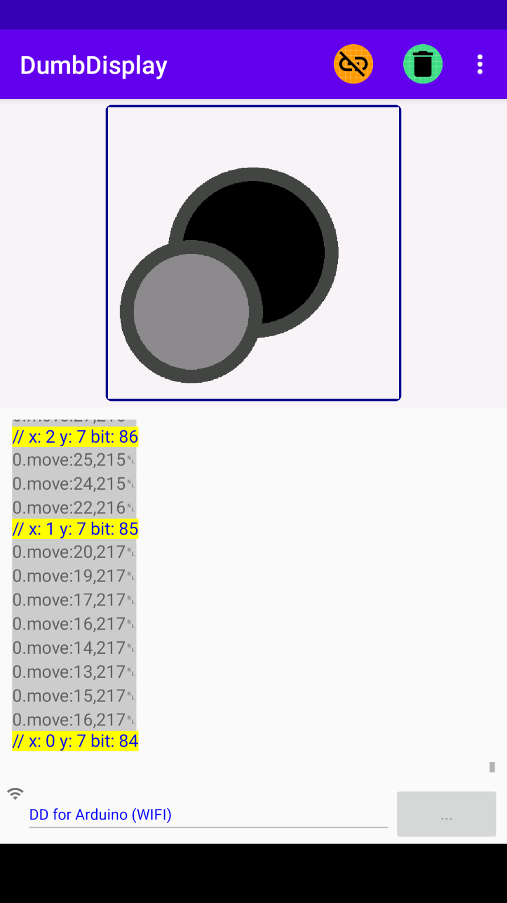
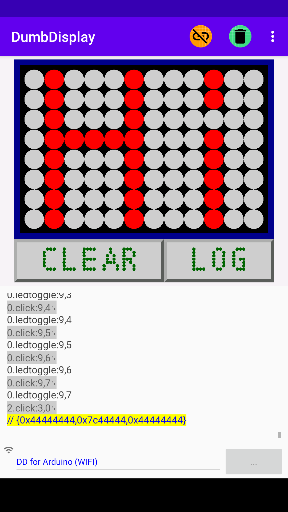

# Arduino UNO R4 WiFi Experiments




With this work, I hope to demonstrate my Arduino UNO R4 WiFi experiments with the microcontroller board's LED matrix, starting from simply turning on/off each one of the LEDs, to having a simple remote UI for controlling the LEDs of the matrix, using an Android app (DumeDisplay) connected using the microcontroller board's WiFi support. 

The microcontroller programs here are Arduino sketches developed using VSCode with PlatformIO, in the similar fashion as described by the post -- [A Way to Run Arduino Sketch With VSCode PlatformIO Directly](https://www.instructables.com/A-Way-to-Run-Arduino-Sketch-With-VSCode-PlatformIO/).

Nevertheless, the sketches should be buildable with Arduino IDE.


# PlatformIO Project for the Sketches

A single PlatformIO project will be used for all the sketches here.

Assuming you have created a PlatformIO project `UNOR4WiFiExperiments` for the board `Arduino UNO R4 Wifi` with the `Arduino` framework.

You should have the file `platformio.ini` similar to

```
[env:UNOR4]
platform = renesas-ra
board = uno_r4_wifi
framework = arduino
monitor_speed = 115200
lib_deps =
    https://github.com/trevorwslee/Arduino-DumbDisplay
```
Notes:
* `UNOR4` is simply the name of the "PlatformIO Project Environment"
* The section `monitor_speed` specifies the baud-rate for the PlatformIO's Serial Monitor to be `115200`
* The section `lib_deps` specifies that the project will be depending on the [DumbDisplay Arduino Library](https://github.com/trevorwslee/Arduino-DumbDisplay)

The file `src/main.cpp` should simply be the two lines like
```
#include <Arduino.h>
#include "INO/matrix_test/matrix_test.ino"
```

Yes, the first sketch will be `src/INO/matrix_test/matrix_test.ino`

# Turning LED Matrix On/Off

`src/INO/matrix_test/matrix_test.ino`
```
#include "Arduino_LED_Matrix.h"
ArduinoLEDMatrix matrix;
void setup() {
  Serial.begin(115200);
  matrix.begin();
}
const uint32_t happy[] = {
    0x19819,
    0x80000001,
    0x81f8000
};
const uint32_t heart[] = {
    0x3184a444,
    0x44042081,
    0x100a0040
};
void loop(){
  matrix.loadFrame(happy);
  delay(500);
  matrix.loadFrame(heart);
  delay(500);
}
```
which is basically directly copied from the web page -- [Using the Arduino UNO R4 WiFi LED Matrix](https://docs.arduino.cc/tutorials/uno-r4-wifi/led-matrix/)

Notes:
* The basic initialization for using the LED matrix is like
  ```
  matrix.begin();
  ```
* To manipulate the LEDs of the matrix, a "frame" of 3 `uint32_t`s is needed, as in `happy` and `heart`
* You load and display a "frame" like
  ```
  matrix.loadFrame(happy);
  ```

Since each one of the 96 bits of the 3 `u_int32_t`s corresponds to a LED of the 12x8 LED matrix, apparently, the LED on/off can be controlled by turning the proper bit on/off, with routine like the following `set_bit()` which sets the corresponding bits of `frame` on/off
```
...
uint32_t frame[] = { 0, 0, 0 };  // 3 32-bit unsigned ints can hold 96 bits
void set_bit(size_t bit, bool on) {
  int index = bit / 32;
  int offset = 31 - (bit % 32);
  if (on) {
    frame[index] |= (1 << offset);
  } else {
    frame[index] &= ~(1 << offset);
  }
}
...
```  

Accordingly, lets try to turn on/off each of the LEDs one by one with sketch `src/INO/matrix_obo_test/matrix_obo_test.ino`

# Turing the LEDs On/Off One-by-One

`src/INO/matrix_obo_test/matrix_obo_test.ino`
```
#include "Arduino_LED_Matrix.h"
ArduinoLEDMatrix matrix;
uint32_t frame[] = { 0, 0, 0 };  // 3 32-bit unsigned ints can hold 96 bits
void set_bit(size_t bit, bool on) {
  int index = bit / 32;
  int offset = 31 - (bit % 32);
  if (on) {
    frame[index] |= (1 << offset);
  } else {
    frame[index] &= ~(1 << offset);
  }
}
void setup() {
  Serial.begin(115200);
  matrix.begin();
}
int bit = -1;  // the bit last turned on
void loop() {
  if (bit != -1) {
    // turn off last bit
    set_bit(bit, false);
  }
  // advance bit
  if (bit == -1) {
    bit = 0;
  } else {
    bit = (bit + 1) % 96;
  }
  // turn on bit
  set_bit(bit, true);
  // load the frame (bits)
  matrix.loadFrame(frame);
  delay(500);
}
```

Notice that as it is looping through, the bit (turned on previously) is first turned off
```
  if (bit != -1) {
    // turn off last bit
    set_bit(bit, false);
  }
```

Then the bit is advanced to next bit, and turn on
```
  // advance bit
  if (bit == -1) {
    bit = 0;
  } else {
    bit = (bit + 1) % 96;
  }
  // turn on bit
  set_bit(bit, true);
```

Finally, the "frame" is loaded and display on the LED matrix
```
  // load the frame (bits)
  matrix.loadFrame(frame);
```

To build and upload the sketch above, you will need to modify `src/main.cpp` as well
```
#include <Arduino.h>
//#include "INO/matrix_test/matrix_test.ino"
#include "INO/matrix_obo_test/matrix_obo_test.ino"
```

# A Simple Remote Virtual Joystick to Control the LEDs

Lets do something, hopefully, more interesting -- use a Joystick to control the LEDs, but use a virtual one, and remotely on your Android phone, with the help of DumbDisplay. 

*For some background of DumbDisplay, you may want to refer to the post [Blink Test With Virtual Display, DumbDisplay](https://www.instructables.com/Blink-Test-With-Virtual-Display-DumbDisplay/)* 

Note that the connection between Arduino UNO R4 WiFi and DumbDisplay Android app will be WIFI. Hence, you will first need to define macros for your WIFI credentials

`src/INO/dd_joystick_test/secret.h`
```
#define WIFI_SSID           "<WIFI-SSID>"
#define WIFI_PASSWORD       "<WIFI-password>"
```

`src/INO/dd_joystick_test/dd_joystick_test.ino`
```
#include "Arduino_LED_Matrix.h"
#include "wifidumbdisplay.h"
#include "secret.h"
ArduinoLEDMatrix matrix;
uint32_t frame[] = { 0, 0, 0 };  // 3 uint32_t can hold 96 bits
void set_bit(size_t bit, bool on) {
  int index = bit / 32;
  int offset = 31 - (bit % 32);
  if (on) {
    frame[index] |= (1 << offset);
  } else {
    frame[index] &= ~(1 << offset);
  }
}
DumbDisplay dumbdisplay(new DDWiFiServerIO(WIFI_SSID, WIFI_PASSWORD));
JoystickDDLayer *joystickLayer;
const size_t JOYSTICK_SIZE = 240;
void setup() {
  Serial.begin(115200);
  matrix.begin();
  // create a joystick layer
  joystickLayer = dumbdisplay.createJoystickLayer(JOYSTICK_SIZE - 1);
  joystickLayer->border(3, "darkblue", "round", 1);
  // turn on bit 0
  set_bit(0, true);
  matrix.loadFrame(frame);
}
int prev_bit = 0;
void loop() {
  const DDFeedback* fb = joystickLayer->getFeedback();
  if (fb != NULL) {
    // got "feedback" (i.e. joystick moved)
    size_t x = int((fb->x * 12) / (double) JOYSTICK_SIZE);
    size_t y = int((fb->y * 8) / (double) JOYSTICK_SIZE);
    size_t bit = x + y * 12;
    if (bit != prev_bit) {
      dumbdisplay.writeComment("x: " + String(x) + " y: " + String(y) + " bit: " + String(bit));
      set_bit(prev_bit, false);
      set_bit(bit, true);
      matrix.loadFrame(frame);
      prev_bit = bit;
    }
  }
}
```

To build and upload the sketch above, you will need to modify `src/main.cpp` as well
```
#include <Arduino.h>
//#include "INO/matrix_test/matrix_test.ino"
//#include "INO/matrix_obo_test/matrix_obo_test.ino"
#include "INO/dd_joystick_test/dd_joystick_test.ino"
```

When the sketch is running, please turn to the Serial Monitor, there you should see log lines like
```
listening on 192.168.0.2:10201 ...
listening on 192.168.0.2:10201 ...
listening on 192.168.0.2:10201 ...
```
which shows the IP address (and port) on which your Arduino UNO R4 WiFi is listening.

Your IP will likely be different than what shown above. Note down the IP address shown. You will need this IP for DumbDisplay WIFI connection. 

On your Android phone side
* Start the DumbDisplay app.
* Click on the Establish Connection icon.
* In the "establish connection" dialog, you should see the "add WIFI device" icon at the bottom right of the dialog. Click on it.
* A popup for you to enter WIFI IP will be shown. Enter the IP address of your ESP board as Network Host. Click OK when done.
* Back to the "establish connection" dialog, a new entry will be added, click on it to establish WIFI connection.

Once connected, you should see the virtual joystick displayed



Moving the joystick should move the turned on LED of your Arduino UNO R4 WiFi LED matrix


# Another Simple Remote UI to Draw on the LED Matrix

The sketch for the captioned UI is a bit longer, and hence will not be listed here.
Instead, you can download the sketch `src/INO/dd_draw/dd_draw.ino` [here](https://github.com/trevorwslee/UNOR4WiFiExperiments/blob/main/src/INO/dd_draw/dd_draw.ino)

*Alternatively, you can clone the complete repo [UNOR4WiFiExperiments](https://github.com/trevorwslee/UNOR4WiFiExperiments) for all sketches mentioned*

I guess by now, you will be aware that all you need to switch the PlatformIO project to target for another sketch is simply to change `src/main.cpp`, like
```
#include <Arduino.h>
//#include "INO/matrix_test/matrix_test.ino"
//#include "INO/matrix_obo_test/matrix_obo_test.ino"
//#include "INO/dd_joystick_test/dd_joystick_test.ino"
#include "INO/dd_draw/dd_draw.ino"
```

And the resulting UI on DumbDisplay app will present you with a canvas for you to draw [dots], which of cause will be synchronized with your Arduino UNO R4 WiFi LED matrix.



- **CLEAR** -- clear the dots
- **LOG** -- show the "frame" on the "terminal" of DumbDisplay app , e.g. `// {0x44444444,0x7c44444,0x44444444}`

Tips:
- By default, DumbDisplay app will show the "commands" sent to it to the "terminal". You can turn this off with the menu "Show Commands"
- You can share the text on the "terminal" to other apps with the menu "Share Terminal Text"

Since the UI allows you to draw "frame" by "frame", with some work (maybe some hard work), you can create an animation to be displayed on the LED matrix, like the sketch `src/INO/frames/frames.ino`

```
#include "Arduino_LED_Matrix.h"
ArduinoLEDMatrix matrix;
void setup() {
  Serial.begin(115200);
  matrix.begin();
}
const uint32_t frames[][3] = {
  {0x20020020,0x2002002,0x200200},
  {0x20020020,0x3e02002,0x200200},
  {0x22022022,0x3e02202,0x20220220},
  {0x22422422,0x3e02202,0x20220220},
  {0x22422422,0x3e42242,0x24224224},
};
const size_t num_frames = sizeof(frames) / sizeof(frames[0]);
int frame_index = 0;  
void loop(){
  matrix.loadFrame(frames[frame_index]);
  delay(500);
  frame_index = (frame_index + 1) % num_frames;
}
```


# Enjoy!

> Peace be with you!
> May God bless you!
> Jesus loves you!
> Amazing Grace!


